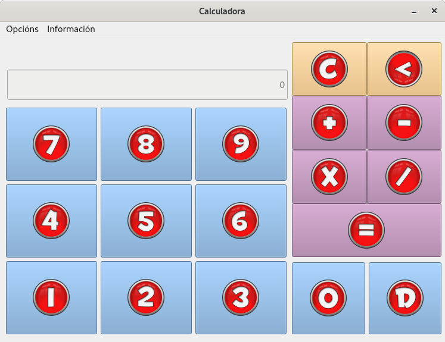

.. Calculadora para nenos documentation master file, created by
   sphinx-quickstart on Sat Apr 17 12:34:20 2021.
   You can adapt this file completely to your liking, but it should at least
   contain the root `toctree` directive.

Interface
=========

A calculadora ten a seguinte imaxe:

Botóns
------

Como se pode comprobar, os iconos están separados por **cores**:

-  **Azul**: Utilizado para remarcar os números e a coma. Con estes botóns poderá interactuarse para introducir os números cos que se quera operar

   .. image:: ../images/numero.png
  
-  **Púrpura**: Utilizado para remarcar as posibles operacións a realizar: suma ('+'), resta ('-'), multiplicación ('*'), división ('/') e igual ('='), para obter o resultado.

   .. image:: ../images/suma.png
  
-  **Laranxa**: Utilizado para os botóns de corrección.

   .. image:: ../images/borrar.png

Pantallas
---------

Na parte superior esquerda, encontrámonos con *dous recadros*:

-  O *superior*: é no que se recollen os datos que vanse introducindo na calculadora para operar. Nel poderase comprobar que estamos a escribir correctamente a operación que se quere realizar.

   .. image:: ../images/operacion.png
  
-  O *inferior*: é no que se recolle o resultado da operación realizada unha vez se pulse no botón igual ('=').

   .. image:: ../images/resultado.png

Menú
----

A aplicación tamén conta cun menú, no que nos encontramos con dous submenús:

-  Submenú **Opcións**:

   .. image:: ../images/opcions.png
  
   -  Limpar: ao igual co botón 'C', reinicaliza a calculadora.
  
  
   -  Saír: mostrará un novo cadro flotante ó usuario para que confirme se quere saír da apliación.

      .. image:: ../images/sair.png

-  Submenú **Información**:

   .. image:: ../images/informacion.png

   -  Manual: dará a opción ó usuario de que se descargue este mesmo manual en formato PDF.

   -  Sobre a app: mostra un cadro flotante coa seguiente información: nome do creador, data de creación, versión actual da app.

      .. image:: ../images/version.png

Fontes externas
---------------

Os iconos empregados para os botóns da calculadora, foron extraidos da seguinte ligazón de recursos gratuitos: https://icon-icons.com/es/pack/Red-Orb-Alphabet-Icons/325

